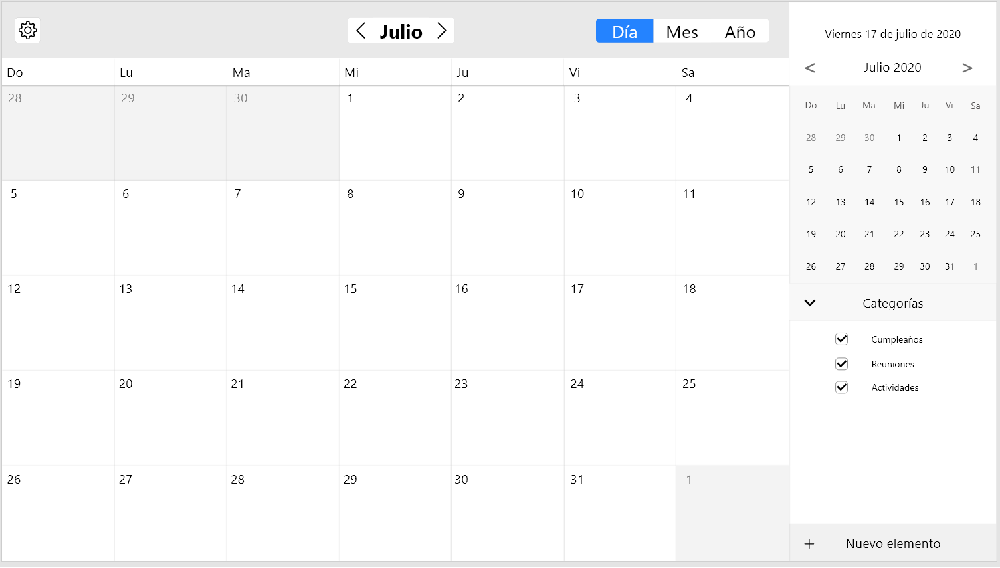

# donotforget



## Prerequisitos

Para empezar a desarrollar, necesitaras las siguientes herramientas: 

* [Git](https://git-scm.com/)
* [Apache Maven](https://maven.apache.org/)
* [AdoptOpenJdk 11 ](https://adoptopenjdk.net/) u otra distribución.

## Aportando al proyecto
### Configurando el entorno

```console
git clone https://github.com/dariovp/donotforget.git
cd donotforget
```

Cambia a la branch development:

```console
git checkout -b development
```

### Aplicando cambios a todos los módulos:
```console
mvn [-U] clean install
```

### Aplicando cambios a los demás módulos:
```console
mvn -pl <nombre_de _modulo> compile package install
```
#### Esta forma de compilar no asegura que las dependencias de cada modulo sean incluidas. En caso de que no funcione, usa la de arriba.

<br />

### Aplicando cambios al archivo CSS dentro del modulo Client:
<br />

#### Necesitaras tener npm (Node.js) instalado y el preprocesador de CSS less. 

<br />

```console
npm i less less-watch-compiler -g
```

#### Una vez instalado, corre el siguiente comando en la carpeta resources dentro de Client:

<br />

```console
less-watch-compiler . . styles.less
```

<br />

## Módulos

El proyecto posee 4 módulos: 
* client: Contiene la interfaz gráfica.
* server: Contiene el servidor, y se encarga de administrar la base de datos.
* remote: Interfaces para la comunicacion a traves de RMI.
* launcher: Se encarga de iniciar los módulos de forma correcta, verificando el estado de cada uno.